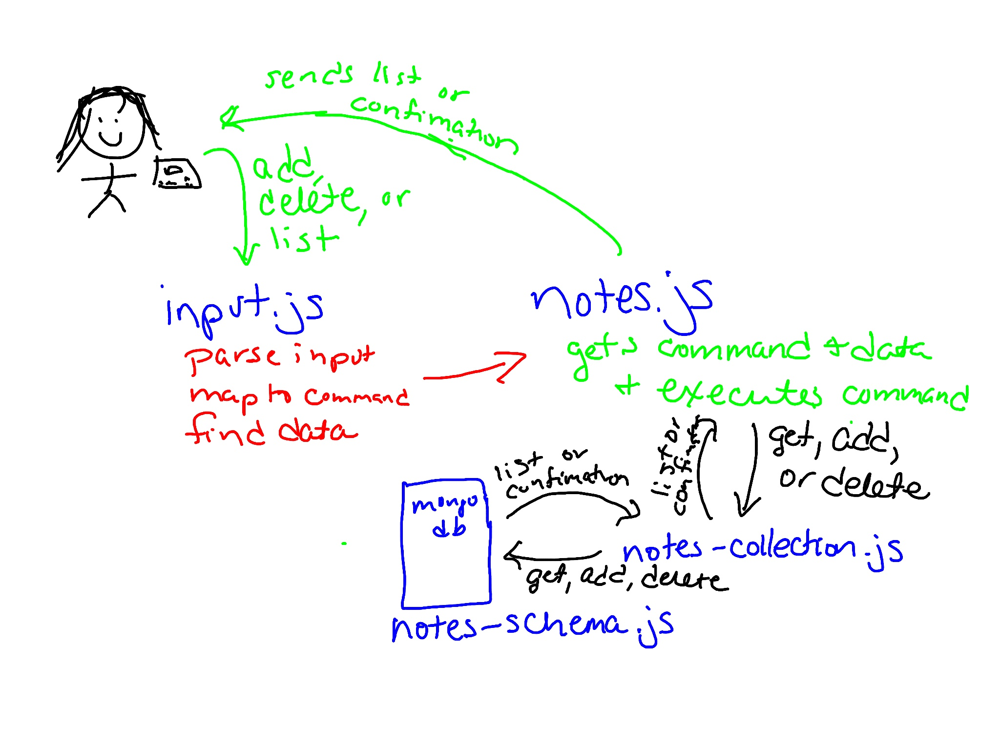

# Notesy

This project contains simple Node Modules meant to run in the terminal.


### Author: Marlene Rinker

- [submission PR](https://github.com/marlenerinker-401-advanced-javascript/notes/pull/6)
<!-- - [tests report](https://github.com/tutuorial-401js/class-00/actions) -->
<!-- - [front-end](https://tutorial-401js.herokuapp.com/) -->

### Setup

#### `.env` requirements

MONGODB_ATLAS_URI=mongodb+srv://dbAdmin:<password>@cluster0-2u75g.mongodb.net/<dbname>?retryWrites=true&w=majority

#### Packages to Install
(see package.json)

dotenv

minimist

mongoose

jest


#### Running the app

To add a note, the options are: --add or -a; use --category or -c to add the category for the note; the action, note text, and category are required

```
node index.js --add 'this is my note' --category 'groceries'

node index.js -a 'this is my note' -c 'school'
```
This adds the note to the database and returns a message in the terminal that it added your note.

To see a list of notes in the database: --list or -l; you can search for all notes or search by category

```
node index.js --list --category 'groceries'

node index.js -l
```
This returns a list of the saved notes based on your request. You get the note, the category, and the ID.

To delete a note from the database: --delete or -d; you need to enter the ID of the note which you can find using list

```
node index.js --delete 5ee1844b888905011cd566f9

node index.js -d 5ee1844b888905011cd566f9
```
This deletes the note from the database and returns a message that it was deleted.


#### Tests

- Unit Tests: `npm test input.test.js`, `npm test notes.test.js`
- Assertions Made
  - Testing if user input is valid or invalid
  - Testing if Input object is created with valid action and payload
  - Testing if get correct log message when add a note, use an invalid command, or don't enter a payload (note content)
  - Testing if get a list of notes with a certain category
  - Testing if you can delete a note

#### UML

